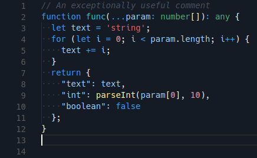
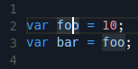
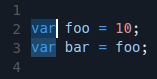
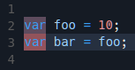
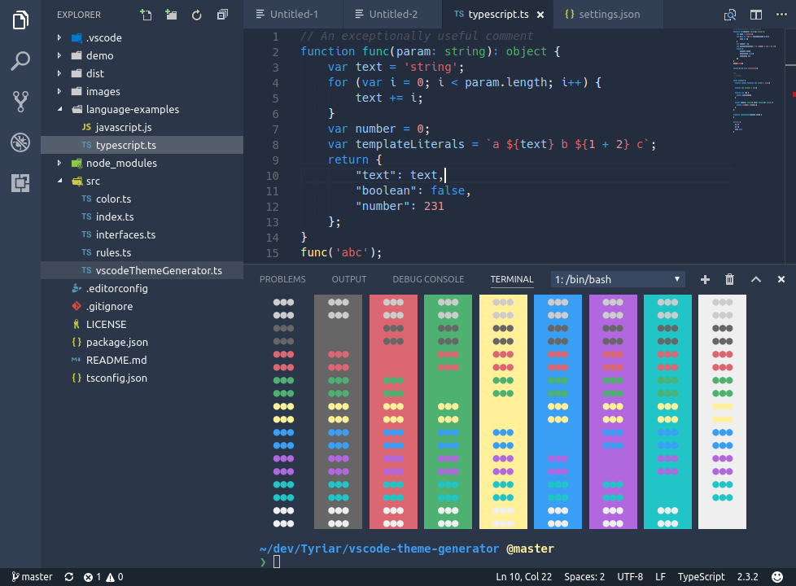
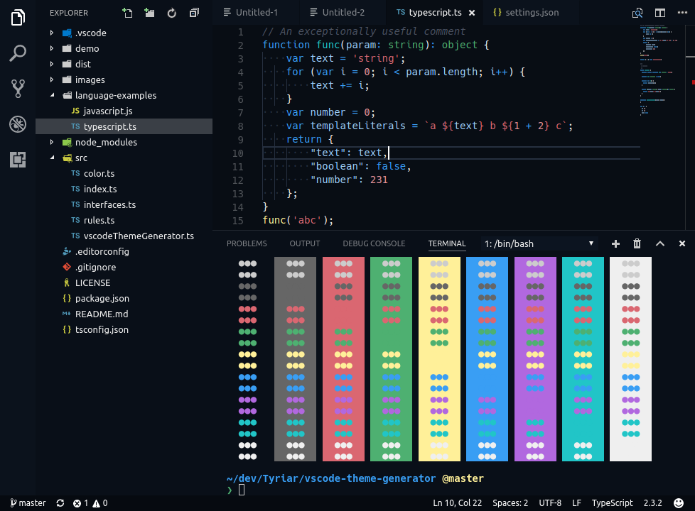

Sapphire is a vibrant blue theme for Visual Studio Code, created with the help of [vscode-theme-generator](https://github.com/Tyriar/vscode-theme-generator).

This theme customizes colors in the editor, workbench and integrated terminal.

## Semantic colors

Colors in Sapphire have strong meaning.

- **Base color** is light blue
- **Keywords and operators** are blue
- **Classes, functions and member variables** are teal
- **Function calls** are yellow
- **Types** are green
- **Strings** are red
- **Numbers** are orange

If you see any inconsistencies with the colors please report them to the [GitHub repo](https://github.com/Tyriar/vscode-theme-sapphire).

## Selection

Sapphire attempts to make selections more clear by giving them distinct colors which stack upon each other nicely.

**Word highlight** is used when the cursor is places over a word/symbol that the language extension recognizes, all other occurrences of the symbol are also highlighted. It's colored using a transparent white.

**Selection highlight** is blue. Other occurrences of the selection text are also highlighted with a slightly brighter blue.

**Find highlight** is used for all matches of find in file (<kbd>ctrl</kbd>/<kbd>cmd</kbd>+<kbd>f</kbd>) and find in files (<kbd>ctrl</kbd>/<kbd>cmd</kbd>+<kbd>shift</kbd>+<kbd>f</kbd>). It's colored in red with the active find selection bring brighter than the others and also having a background highlight.

## Dim and Bright Variants

The theme also includes a dim and a bright variant.

